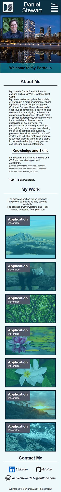
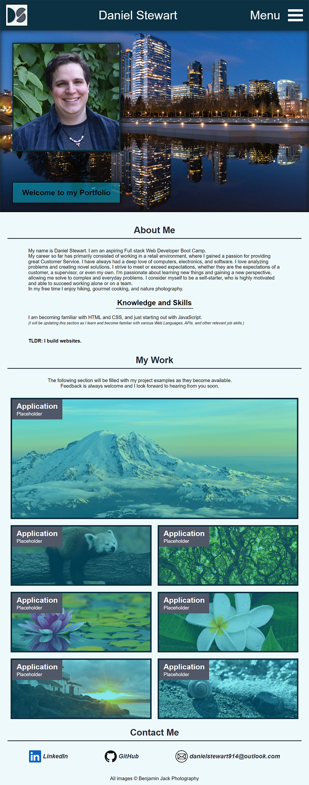
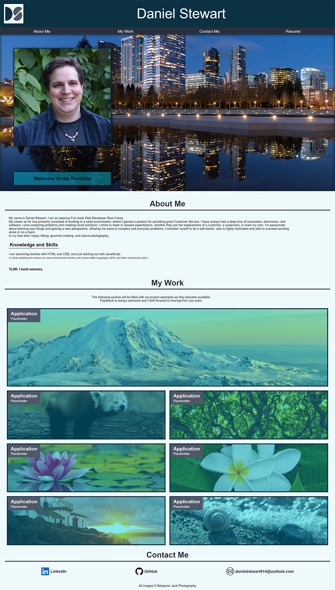

# Portfolio
My personal portfolio page showcasing my work.

## My Favorite Things

I enjoy being creative and wanted to shout out my favorite parts of this project.

* I made a custom menu button using HTML and CSS that keeps the menu hidden on smaller screens until it is needed.
* I made a Logo using draw.io to use as a favicon. I then recreated it by styling div tags with css to display the logo on my page.

### Accessibility

As I learn more about Accessibility the importance of keeping my designs accessible to as many people as possible I strive to add as many accessibility features as I can. The following items are what I have included in my Portfolio so far.

* I included a skip link to the main content to make the site more accessible for people who are using a screen reader.
* The menu when hidden on small screens will open automatically when tabbed into for those who cannot use a mouse and use only a keyboard.
* I made sure my color pallette met WCAG AAA contrast guidelines.
* I used the [WAVE Web Accessibility Evaluation Tool](https://wave.webaim.org/) to check my page and fixed any errors or warnings.

## Future Goals

The current implementation of my portfolio is just the start of a dynamic and constantly updating project.
I plan on modifying the page itself to include new features and capabilities as I learn and grow my knowledge base.
I currently have placeholders in the My Work section and will add links to my deployed projects and Applications as I create them.
### Deployed Page
[Click here to view Portfolio](https://danielstewart914.github.io/Portfolio/)

Preview images on various screen sizes.

